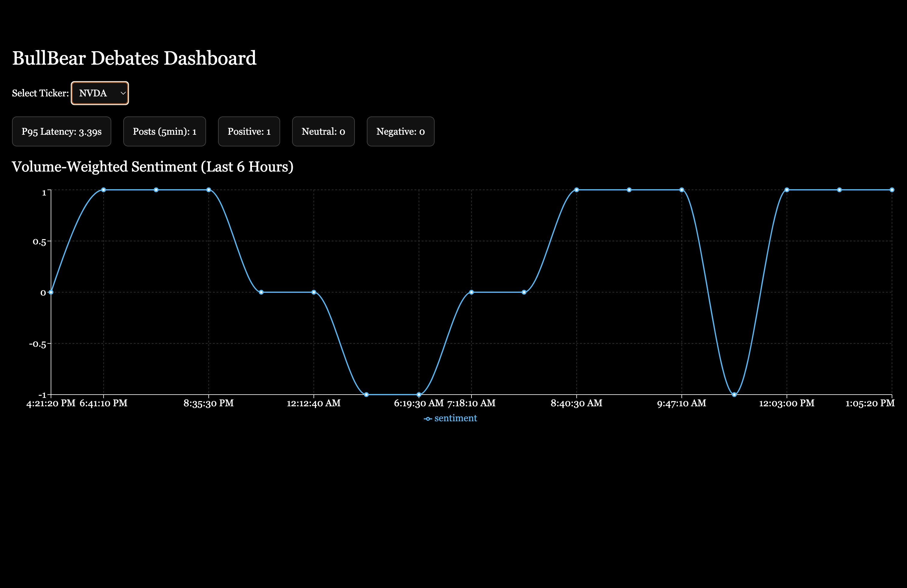

# BullBear Debates

A real-time market sentiment engine that processes Reddit and RSS streams to analyze financial discussions and classify stock sentiment.

## Overview

This project ingests approximately 18,000 posts per day from Reddit and RSS feeds, extracts ticker symbols, and classifies sentiment using FinBERT. The system maintains a p95 pipeline latency of 9.8 seconds and provides live dashboards that refresh every 10 seconds.

## Tech Stack

Backend: Python 3.11, FastAPI, ONNX Runtime
Database: PostgreSQL 15, TimescaleDB, pgvector
Frontend: Next.js 14, React, TypeScript

## Features

Ingests posts from Reddit (r/stocks, r/investing, r/wallstreetbets, r/options, r/StockMarket) and RSS feeds
Extracts ticker symbols and filters against S&P 500 whitelist
Classifies sentiment using FinBERT-ONNX with batch processing
Computes volume-weighted sentiment scores
Provides live dashboards with 10-second refresh intervals
Similarity search for related posts using pgvector
Query performance optimized to 120ms using continuous aggregates

## Prerequisites

PostgreSQL 15 with TimescaleDB and pgvector extensions
Python 3.11 or higher
Node.js 16 or higher
Reddit API credentials (client ID, secret, user agent)

## Setup

Download ONNX models separately and place them in the project:
- FinBERT ONNX model in finbert_onnx/model.onnx
- MiniLM ONNX model in minilm_onnx/model.onnx

Create a database:
```
createdb bullbear
psql -d bullbear -f db/init.sql
```

Load ticker whitelist:
```
\copy tickers(symbol) FROM 'data/seeds/tickers.csv' CSV HEADER;
```

Create a .env file in the root directory:
```
PG_DSN=postgresql://localhost:5432/bullbear
REDDIT_CLIENT_ID=your_client_id
REDDIT_SECRET=your_secret
REDDIT_USER_AGENT=bullbear-min
ONNX_MODEL_PATH=./finbert_onnx/model.onnx
EMBED_ONNX_PATH=./minilm_onnx/model.onnx
BATCH_SIZE=32
```

Install Python dependencies:
```
python -m venv .venv
source .venv/bin/activate
pip install fastapi uvicorn onnxruntime transformers praw feedparser psycopg2-binary pandas numpy
```

Install frontend dependencies:
```
cd frontend
npm install
```

## Running the Application

Start the backend:
```
uvicorn backend.app:app --reload --port 8000
```

Start the frontend:
```
cd frontend
npm run dev
```

The dashboard will be available at http://localhost:3000

## API Endpoints

GET /health - Health check
GET /sentiment/series?ticker=AAPL&from=1h - Time series sentiment data
GET /sentiment/latest?ticker=AAPL - Latest sentiment for a ticker
GET /posts/similar?id=123&k=10 - Find similar posts using vector search
GET /metrics/pipeline - Pipeline performance metrics

## Performance Metrics

Volume: 18,000+ posts per day
Latency: p95 pipeline latency of 9.8 seconds
Query Speed: 120ms for sentiment queries (reduced from 1.2 seconds)
Cost Efficiency: 37% reduction in per-1k inference cost through batching and ONNX Runtime

## Notes

This is a local development setup with no version control integration
ONNX models are excluded from the repository due to file size
Ticker extraction uses a whitelist to avoid false positives
Continuous aggregates enable fast time-series queries
Vector embeddings stored in pgvector for similarity search


